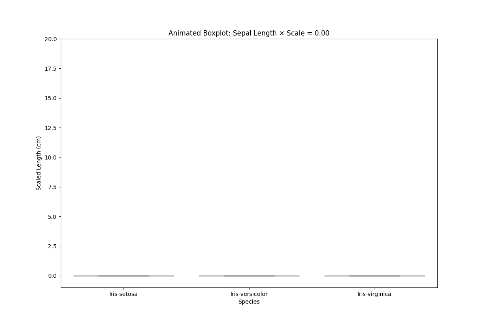

# 🌸 Iris Flower Visualization – Sepal Length by Species  

This project visualizes the **sepal length** of Iris flowers across different species.

## 📊 Project Overview  
- Dataset: [Kaggle](https://www.kaggle.com/datasets/arshid/iris-flower-dataset)
- Focus: **Sepal length** distribution across the three Iris species:  
  - *Iris setosa*  
  - *Iris versicolor*  
  - *Iris virginica*  

The goal is to show how sepal length varies between species and provide clear visual insights.  

## 🛠️ Tools & Libraries  
- **Python 3**  
- **pandas** – data manipulation  
- **matplotlib / seaborn** – data visualization

- ## Preview
- 
